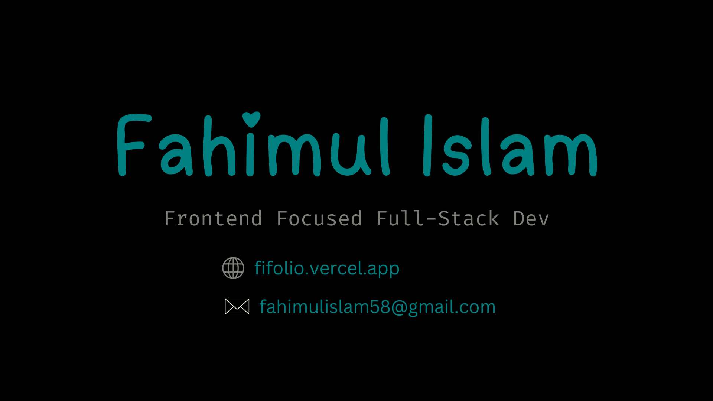

<!-- Introduction Part -->

  

<h2 align="center">Hey 👋 Assalamu-alaikum, I'm Fahimul Islam</h2>

A practicing muslim :heart: and technology lover from Bangladesh 🇧🇩.

<!-- Some Counters -->

     &nbsp;
     &nbsp;

- 🌱 I’m currently learning **Javascript, React, Next js**

- 👨‍💻 All of my projects are available at **[Github](https://github.com/Fahim047)**

- 💬 Ask me about **Web Development, Software Engineering**

- 📫 Email me at **fahimulislam58@gmail.com**
<!-- Technologies I use  -->

## 🚀 Skills

#### Programming Languages

#### Frontend Technologies

#### Backend Technologies

#### Database & Tools

#### Other tools & Technologies

## Connect with me

<!-- Github Statistics -->

### ⚡ My Github Statistics ⚡

<!-- Github Most Used Languages -->

### ❤️ Most Used Language

<!-- Github Contribution Streak -->

### 🔥 Streak

<!-- Github Trophy -->

## 🏆 GitHub Trophies

## 👨‍💻 My Open Source Projects

<table>
  <thead align="center">
    <tr border: none;>
      <td><b>🎁 Projects</b></td>
      <td><b>⭐ Stars</b></td>
      <td><b>📚 Forks</b></td>
      <td><b>🛎 Issues</b></td>
      <td><b>📬 Pull requests</b></td>
    </tr>
  </thead>
  <tbody>
    <tr>
      <td><a href="https://github.com/fahim047/fahim047"><b>My README</b></a></td>
      <td></td>
      <td></td>
      <td></td>
      <td></td>
    </tr>
	  <tr>
      <td><a href="https://github.com/Fahim047/master_academy"><b>Master Academy</b></a></td>
      <td></td>
      <td></td>
      <td></td>
      <td></td>
    </tr>
    <tr>
      <td><a href="https://github.com/Fahim047/golang_tutorials"><b>Golang Tutorials</b></a></td>
      <td></td>
      <td></td>
      <td></td>
      <td></td>
    </tr>
  </tbody>
</table>

## 💰 You can help me by Donating

